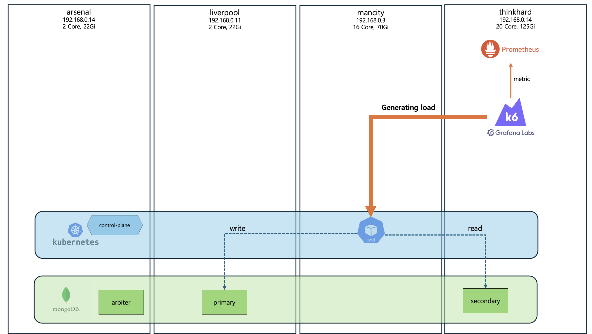

# Performance Test Environment

> All performance test results in this report are based on **JDK 21 (Eclipse Temurin)**.

## Configuration Diagram

- The server that is the target of the performance test is deployed only on specific nodes. To reduce noise, other workloads on these nodes are minimized.
- The load generator runs on independent nodes, separate from the server nodes.
- The load generator used was [k6](https://grafana.com/docs/k6/latest/), and metrics were measured by adding custom metrics to the script.

## Data
The following 2 MongoDB catalogs have data loaded:
- jenie-hello: 1 million records
- jenie-olleh: 1 million records

1,000 records are extracted from each catalog for use in API calls during performance testing. 'jenie-hello' and 'jenie-olleh' are used in equal proportions for performance testing.
For example, if there are 10,000 API calls, approximately 50% will use 'jenie-hello' and 50% will use 'jenie-olleh'.

## Iteration
In one iteration, the following 3 APIs are called:
- ListArticle
- ListMoreArticle
- ViewArticle

From a MongoDB perspective, the following 3-4 queries are used:
- 2 read queries related to viewing the article list
- 1 read query related to viewing article details
- 1 write query to increase the article view count